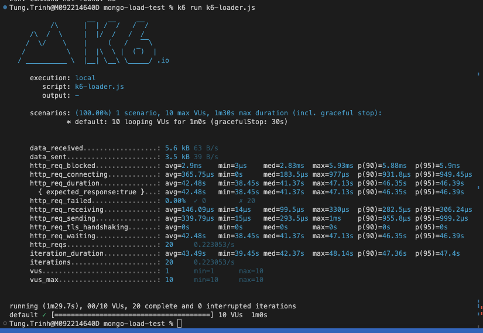

1. Testing with Promise All
500 MB = 150k Product Documents

400 MB = 100k Product Documents
14 connections established
time taken: 2mins

client.close() doesnt help!

10 concurently requests => 47s

This doesnt actually simulate the real behaviors!

2. Testing with k6.io

10 concurently requests => 41s

